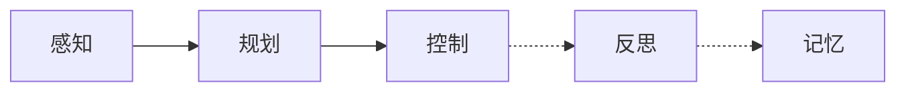
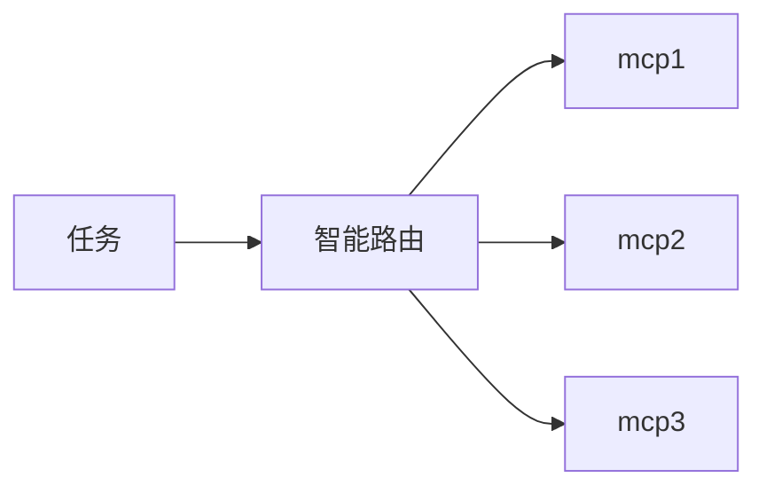
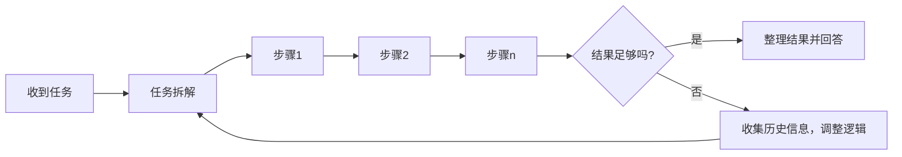
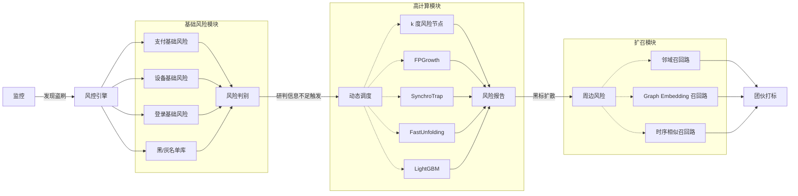

# Agent 实战：智能路由、任务拆解与链路工程

大模型（LLM）的输入是语言，输出也是语言，它终究是一种语言模态。如果它想拥有影响真实世界的能力，就需要操纵代码、操纵机械臂。因为我们的大模型没有智能到自己适应工具，所以需要工程师帮它开发接口，通过接口桥接到各种工具上。这种想法是如此的平滑和自然，以至于它确实就是这么实现的 ......

- 2024 年 11 月，Anthropic [MCP](https://github.com/modelcontextprotocol/servers) 发布
- 2025 年 1 月，[Qwen Agent](https://github.com/QwenLM/Qwen-Agent) 发布
- 2025 年 3 月，[OpenAI Agents](https://github.com/openai/openai-agents-python) 发布
- 2025 年 4 月，Google [A2A](https://github.com/google-a2a/A2A) 发布

每项技术的发布，都在逐步解决我们关切的问题。MCP 解决模型与外部工具统一协议的问题；Agent 解决 LLM 之间如何沟通协作的问题；A2A 可能有点为时尚早，它解决的是 Agent 之间的组织问题。

## 一、引言

### 1. 尚未到来的智能涌现

> We always overestimate the change that will occur in the next two years and underestimate the change that will occur in the next ten. -- Bill Gates

把大象放进冰箱只需要三步。让大模型实现自举，似乎也不需要太多步：

1. 让大模型自己处理语料
2. 让大模型自己训练自己
3. 让大模型自己运行评估脚本、反思、优化、调整超参、继续实验 ......

完成这样一个循环，大模型就能自己提升自己，也就是能够 **自举** 了。只要完成一次，就意味着它能完成两次、三次，不断地自我进化，还蛮恐怖的。

理想很丰满，现实很骨感。我们尚且无法完成这样的循环。可能是基座模型不够强大，也可能是 Agent 依然太弱。从当前这个比较初级的 Agent 对大模型能力提升的幅度来看，我倾向于认为，要实现 AGI，恐怕还是要基座模型本身实现 AGI 才行。用投资领域的话说，Agent 不是 Alpha，最多是 Smart Beta.

回看 2024 年，Agent 曾被寄予厚望。那是技术大爆发的一年。Sora, [GR](https://arxiv.org/abs/2402.17152), GPT-4o 等技术层出不穷，大家对 AI 的前景无限乐观。马斯克说，到 2025 年，人工智能可能比任何一个人类都聪明 [[原文](https://x.com/elonmusk/status/1767738797276451090)]。回到现实，既然这波 Agent 红利没有带来智能涌现，今年 AGI 的可能性已经非常小了。

### 2. 小米加步枪

Agent 的本质是：模型能力不够，工程方法来凑。

一个大模型上下文窗口有限，思考时间有限。通过组织多个大模型一起工作，每个大模型负责其中一块内容。然后像人一样组织它们，通过分发、交接、聚合等操作，形成一个个工作流。如此便能突破单个大模型的上限，做更多复杂的事情。



Agent 工作流大多遵循以下模式：

- **感知**：一个任务过来，无论是 **被动接受** 任务信息，还是 **主动探索** 与任务有关的线索，这都属于“感知”。
- **规划**：有了对任务的感知，这里我们拆解任务，规划出一条或多条实现路径
- **控制**：有了实现路径，在路径上的每一个节点，通过 MCP 调度资源，执行任务；如果当前节点遇到难以解决地问题，动态地创建 sub-agent 继续分解任务
- **反思**：如果有多条实现路径，对多条路径的结果进行评估；如果某条路径失败，总结失败经验，重新来过
- **记忆**：收集本次任务信息，提炼要点，存入知识库。下次执行相似任务时，作为先验知识

一个 LLM 搞不定，就用多个 LLMs 解决；没有大炮没关系，就用小米加步枪的方式战斗。

### 3. 还有 MCP

MCP 相当于引入了 `Action -> React` Pair。模型可以通过 MCP 与真实世界交互，获得即时的反馈。比如：

- **FastAPI**（接入中台能力）
- **PostgreSQL**（长期记忆）
- **Redis**（短期记忆）
- **Docker**（执行代码的能力）

如果说 Agent 是眼睛和脑袋，MCP 就是手。人类也是靠 **眼 -> 脑 -> 手** 循环，把活干起来的。

### 4. Agent 能做什么

**1）智能路由（Function Calling）**

可以把 Agent 当调度器使用，但这个调度不能太简单。如果简单到可以用 `if else` 实现，那就有点画蛇添足了。智能路由是由 **Function Calling** 技术实现的，这个技术在 LLM 刚出的时候就已经很常见，算是经典功能了。



> **Note:** 举个智能路由的例子，我们可以开发一个 **客诉核查 Agent**。如果用户投诉“商家未发货”，就去查商家发货记录；如果用户投诉“好几天了，我还没收到快递”，就去查物流记录；如果用户投诉“商家真没素质”，就去核查聊天记录。这样根据不同投诉内容，查询对应的业务表的能力，就属于智能路由的范畴。

**2）任务拆解（ReAct 模式）**

理想情况下，我们把 MCP 开发好丢给 Agent，告诉它我们最终要什么。Agent 应该自己组织工作，先将任务拆解成若干执行步骤，再将每个步骤交由 MCP 执行。这种模式已经有了，但可能没那么好用，它叫 **ReAct 模式**。

ReAct 模式 (Reasoning-Action) 是一种结合了 **思考决策 (Reasoning)** 和 **环境交互 (Action)** 的智能体框架。其核心逻辑是：首先规划一系列操作，再基于操作结果进一步思考，循环往复直至解决问题。ReAct 模式目前不太好用，很容易跑偏，但是相信随着基座模型的发展，它会越来越好用。



<!-- 举个例子，我们开发一个 **选课通知 Agent**。当我们告诉 Agent，给所有同学发选课通知，它会查询学生表，获取学生邮箱，然后调用邮箱 MCP 给同学们发送邮件；当我们要求给没选课的同学发送邮件提醒，它会查询没选课的学生，并撰写文案，发送提醒邮件；当我们要求给挂科的同学发送邮件时，它会联合成绩表，查询挂科同学的邮箱，然后发送选课通知。 -->

**3）深度研究（Deep Research）**

当需要解决业务难题时，仅凭 Function Calling 或 ReAct 是不够用的，你要做 Agent 的 **链路工程**。具体来说，你要将 Function Calling 和 ReAct 作为基础组件，开发许多工作流。



以上是一个 **风控引擎 Agent**。当用户在支付路由下触发预警时，监控会向风控引擎发送一条消息，形如：

```json
{
    "uid": 1133557,
    "reason": "Card Fraud",
    "timestamp": "2025-06-01 19:21:09"
}
```

风控引擎 Agent 首先会运行一个初步的排查程序，生成简单的风险报告。如有必要，它可以调用更多高消耗的计算模块，获得更多维度的风险信息，最后综合所有风险信息进行研判。如果该用户真的有问题，它还能继续探查该用户的周边风险，召回更多有问题的用户，进而打击整个团伙。

参考：[deep-research](https://openai.com/index/introducing-deep-research/)


<!-- 
**好了，现在我们来总结一下。**

上面三件事的难度是逐层递进的。最简单的是智能路由，其次是任务拆解，最难的是深度探索。

1. 智能路由只是作为 **一个决策体**，参与一个稍微复杂的决策任务。这是最初级的 Agent。
2. 任务拆解是，我们给它输入 (input)、输出 (output)，并提供必要的工具 (MCP Server)。我们期待它 **自己推理出应该执行什么流程，如何使用工具**，来得到我们想要的结果。这已经相当接近工程师平时干的事，只是需要针对特定任务设计，还不够通用，不够泛化。但是已经相当棒了。这是一个中等难度的 Agent。
3. 深度探索是 **树状，甚至网状结构** 的。它的目标是执行一个困难任务，里面既有已经规划好的流程，也有松散的需要根据情况自主规划的子 Agent。它能够通过任务执行到当前步，所获得信息，动态地调整后续步骤的执行内容。通过这种方式，以尽可能小的计算量，达成最好的结果。这也可以被成为 deep research 范式，是目前能想到的，比较高级的 Agent。稍微泛化了一点，但依然谈不上通用。

本文只是一个小小的 Side Project. 无法支持 3 这种体量的开发。我会尽量实现 1 和 2. -->

### 4. 世之显学

Agent 之后，**Agentic** 已经成为一种显学。什么都可以 Agentic 一下。比如 RAG 用 Agent 重做一下，就叫 [Agentic RAG](https://langchain-ai.github.io/langgraph/tutorials/rag/langgraph_agentic_rag/)。

这是一件好事，只有当 Agent 加入系统的收益高于成本，它才能有效地嵌入系统。起码目前的情况说明 Agent 真的有用，它可以为很多软件系统带来提升，比如智能客服、内容风控、商业智能 (BI) ......

真是不可思议，短短数年间，我们经历了：

- 互联网 +
- AI +
- LLM +
- Agent +

其实每个技术的细枝末节都发展得很合理。但是跳出细节一看，还是会被技术爆发的速度所震惊。不知道的还以为 [2017 年](https://arxiv.org/abs/1706.03762) 我们捕获了一艘外星飞船呢。


<!-- > 回到务实的问题，Agent 能做什么？

Agent 是大模型的调度器，它擅长的无非是大模型擅长的那些，外加一些由组织产生的能力。

我看到有些公司，把 Agent 当作中台服务的调度器。先用 MCP 把中台能力轮询一遍，再用一个 LLM 总结轮询的结果。这当然也是一种用法，但有点画蛇添足。因为用传统的 `for loop` 和 `if else` 控制块，也能实现同样的功能。

**Agent 的价值在传统编程的能力圈之外。**

LLM 的引入增加了成本和不确定性。传统编程能实现的东西，没必要非用 Agent 实现。拿着锤子找钉子就没意思了。我们要找 Agent 能做到，但是传统编程做不到的事情。 -->


<!-- 对于需要深入探索的场景，Agent 可以控制探索的 **深度** 和 **广度**。在拥有 MCP 之后，甚至有了“再探再报”的功能。通过前置信息和主动补全信息，**动态调度** 计算资源。这样它可以在最小的计算量下，获取最精准的探查报告。 -->